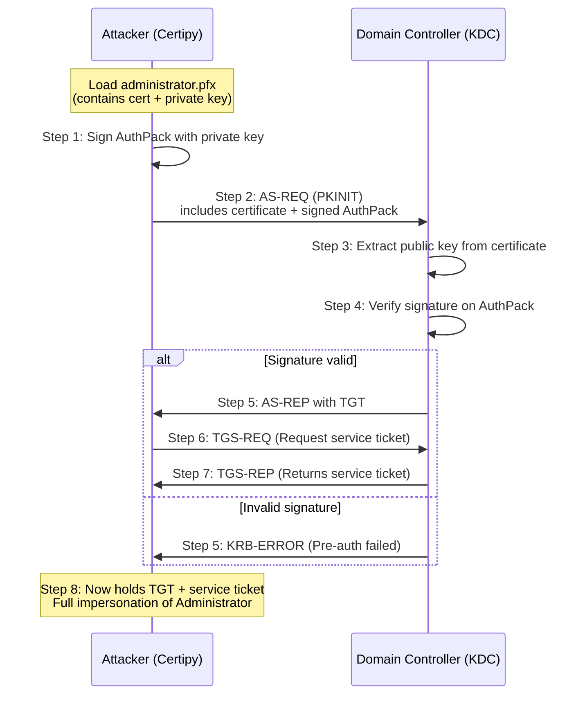

To obtain a certificate from AD CS, clients go through a process called enrollment. The client generate a public-private key pair and place the public key in a certificate signing request (CSR) message along with other details such as the the subject of the certificate and the certificate template name. ***Clients then sign the CSR with their private key and send the CSR to CA server. 

The CA server checks if the client can request certificates. If so, it will issue a certificate by looking up the certificate template that was requested in the CSR. if the template is permissions allow authenticating this user, the CA generates certificate using the *blueprint* of the certificate template (e.g, EKUs, issuance requirements, .., ..) and using the other info that was supplied in the CSR. If everything checks out the CA will then sign the certificate using the CA's private key then returns it to the client.

![[Pasted image 20250721061318.png]]

some important EKUs with their OU:
![[Pasted image 20250721061858.png]]
these when present in the certificate, permit authentication to AD.

***
How it can be abused??





<pre><code>```mermaid flowchart TD A[User (Low-priv)] -->|1. Discover vulnerable template| B[Cert Template: ClientAuth + ENROLLEE_SUPPLIES_SUBJECT] B -->|2. Request cert with DA UPN| C[Cert Issued] C -->|3. Export .pfx cert+key| D[PFX File] D -->|4. Use cert to get TGT via PKINIT| E[TGT for Domain Admin] ```</code></pre>
