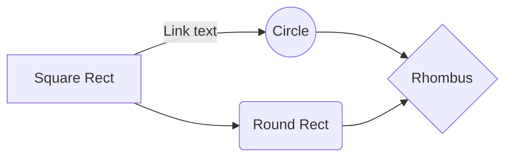
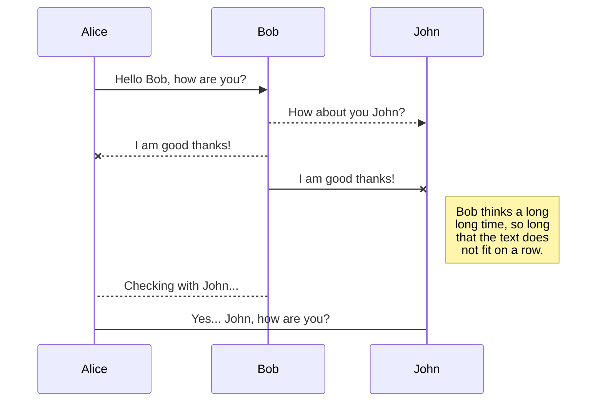

The vulnerability materializes when these conditions are met:
- **Template with "Any Purpose" or No EKU:** The template either explicitly contains the "Any Purpose" EKU or has no EKUs defined (which implies any purpose).
- **Permissive Enrollment Rights:** Low-privileged users (e.g., members of "Domain Users" or "Authenticated Users") are granted enrollment permissions for this template.

basically same as ESC1 but with `Any Purpose EKU` which is more dangerous/

| Feature                                | ESC1 (with only `ClientAuth`) | ESC2 `Any Purpose EKU` |
| -------------------------------------- | ----------------------------- | ---------------------- |
| Abuses `PKINIT` for user impersonation | ✅ Yes                         | ✅ Yes                  |
| Can impersonate **Domain Controllers** | ❌ No (needs DCAuth EKU)       | ✅ Yes                  |

---

Exploitation of ESC2 typically involves two key components:

1. **Obtaining an Any Purpose Certificate:** The attacker first enrolls for and obtains a certificate from the misconfigured template that grants "Any Purpose" (or has no EKU).
2. **A Target Certificate Template Allowing Agent Enrollment:** A second certificate template (the "target template") must exist with the following characteristics:
    - It issues certificates suitable for client authentication (e.g., it contains the "Client Authentication" EKU).
    - It is configured to allow an Enrollment Agent to request certificates on behalf of other users. Many default templates, particularly Schema Version 1 templates like the built-in "User" or "Machine" template, inherently permit this without specific enrollment agent restrictions in their issuance policy.
    - The intended victim (e.g., a Domain Administrator) must have enrollment rights on this target template.

